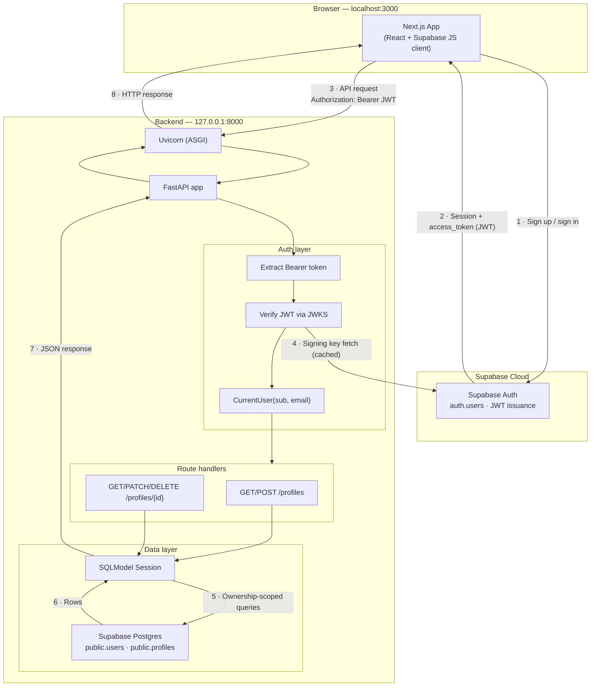

# HealthHistorian — Local Dev Architecture

## Auth + Profile Request Flow

```mermaid
flowchart TD
  subgraph client [Browser — localhost:3000]
    app["Next.js App<br/>(React + Supabase JS client)"]
  end

  subgraph supaAuth [Supabase Cloud]
    authSvc["Supabase Auth<br/>auth.users · JWT issuance"]
  end

  subgraph backend [Backend — 127.0.0.1:8000]
    uvicorn["Uvicorn (ASGI)"]
    fastapi["FastAPI app"]

    subgraph auth [Auth layer]
      bearer["Extract Bearer token"]
      jwks["Verify JWT via JWKS"]
      currentUser["CurrentUser(sub, email)"]
    end

    subgraph routes [Route handlers]
      profiles["GET/POST /profiles"]
      profile["GET/PATCH/DELETE /profiles/{id}"]
    end

    subgraph data [Data layer]
      session["SQLModel Session"]
      db["Supabase Postgres<br/>public.users · public.profiles"]
    end
  end

  app -->|"1 · Sign up / sign in"| authSvc
  authSvc -->|"2 · Session + access_token (JWT)"| app

  app -->|"3 · API request<br/>Authorization: Bearer JWT"| uvicorn
  uvicorn --> fastapi
  fastapi --> bearer
  bearer --> jwks
  jwks -->|"4 · Signing key fetch (cached)"| authSvc
  jwks --> currentUser

  currentUser --> routes

  profiles & profile --> session
  session -->|"5 · Ownership-scoped queries"| db
  db -->|"6 · Rows"| session
  session -->|"7 · JSON response"| fastapi
  fastapi --> uvicorn
  uvicorn -->|"8 · HTTP response"| app
```
