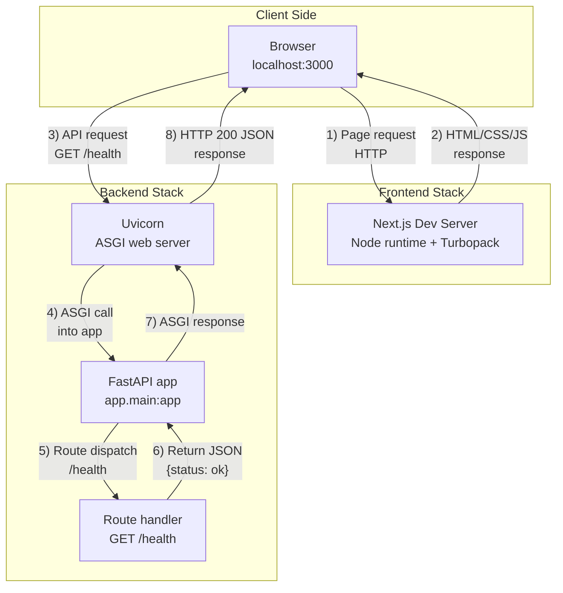

# HealthHistorian Local Dev Flow

```mermaid
flowchart TD
  subgraph clientSide [Client Side]
    browser["Browser<br/>localhost:3000"]
  end

  subgraph frontendStack [Frontend Stack]
    nextDev["Next.js Dev Server<br/>Node runtime + Turbopack"]
  end

  subgraph backendStack [Backend Stack]
    uvicorn["Uvicorn<br/>ASGI web server"]
    fastapi["FastAPI app<br/>app.main:app"]
    healthHandler["Route handler<br/>GET /health"]
  end

  browser -->|"  1) Page request  <br/>  HTTP  "| nextDev
  nextDev -->|"  2) HTML/CSS/JS  <br/>  response  "| browser

  browser -->|"  3) API request  <br/>  GET /health  "| uvicorn
  uvicorn -->|"  4) ASGI call  <br/>  into app  "| fastapi
  fastapi -->|"  5) Route dispatch  <br/>  /health  "| healthHandler
  healthHandler -->|"  6) Return JSON  <br/>  {status: ok}  "| fastapi
  fastapi -->|"  7) ASGI response  "| uvicorn
  uvicorn -->|"  8) HTTP 200 JSON  <br/>  response  "| browser
```
